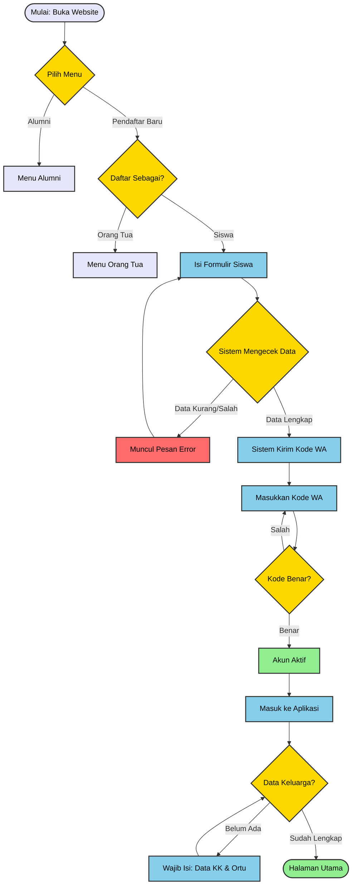
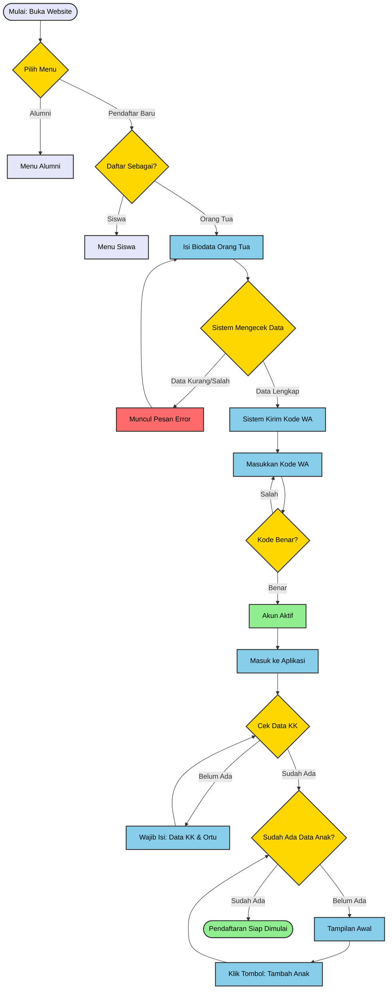

# Overview SIPS YAB

> Sistem Informasi Penerimaan Siswa Yayasan Al Ma'soem Bandung.

Sistem ini dirancang untuk memfasilitasi proses Pendaftaran Calon Siswa/i Al Ma'soem secara online, mulai dari pendaftaran akun, verifikasi berkas, hingga pengumuman kelulusan.

---

## Fitur Utama

Berikut adalah kapabilitas utama sistem saat ini:

- **Front-Office (Siswa dan Orang Tua/Wali):**
  - [x] Registrasi Akun & Login
  - [x] Input Biodata & Upload Dokumen (KK, Akta, Ijazah)
  - [x] Metode Pembayaran Terintegrasi
  - [x] Cetak Kartu Bukti Pendaftaran (PDF)
- **Back-Office (Admin, Panitia dan Stakeholders):**
  - [x] Dashboard Statistik Real-time
  - [x] Verifikasi Dokumen (Approve/Reject)
  - [x] Export Data ke Excel

> Jika gambar diagramnya tidak muncul, silakan _refresh_ halamannnya.

## Alur Pembuatan Akun Pendaftaran (Siswa)

Berikut adalah alur pendaftaran sistem sebagai Pendaftar Baru (Siswa):

## Alur Pembuatan Akun Pendaftaran (Orang Tua)

Berikut adalah alur pendaftaran sistem sebagai Pendaftar Baru (Orang Tua):

?> **Keterangan Warna Diagram:**
Kuning = Pilihan/Logika Sistem
Biru = Aktivitas Anda
Hijau = Berhasil
Merah = Error/Masalah

## Tahapan Pendaftaran

  

    <h3>1️⃣ Data Siswa & Orang Tua</h3>
    
Lengkapi formulir pendaftaran dengan data diri calon siswa dan orang tua secara akurat. Pastikan semua kolom terisi dengan benar (sesuai KK/Akte).

  

  

    <h3>2️⃣ Persetujuan & Komitmen</h3>
    
Baca dan setujui syarat, ketentuan, dan surat pernyataan komitmen (Tata Tertib & Biaya) sebagai bagian legalitas proses pendaftaran.

  

  

    <h3>3️⃣ Pembayaran Administrasi</h3>
    
Selesaikan pembayaran biaya pendaftaran melalui Virtual Account atau Transfer Bank yang tersedia untuk membuka akses ke tahap finalisasi.

  

  

    <h3>4️⃣ Finalisasi Data</h3>
    
Periksa kembali seluruh data. <b>Peringatan:</b> Setelah tombol Finalisasi ditekan, data akan dikunci dan tidak dapat diubah lagi.

  

---

<h2>Butuh Bantuan?</h2>

Jika Anda mengalami kendala saat pendaftaran (misal: Kode WA tidak masuk atau gagal upload berkas), silakan hubungi tim Support kami:

- **WhatsApp Helpdesk:** [0812-XXXX-XXXX](https://wa.me/62812xxxx) (Jam Kerja 08.00 - 15.00)
- **Email:** [sips.almasoem.com](https://sips.almasoem.com/)
- **Panduan Teknis:** [Klik di sini untuk melihat FAQ](faq.md)
